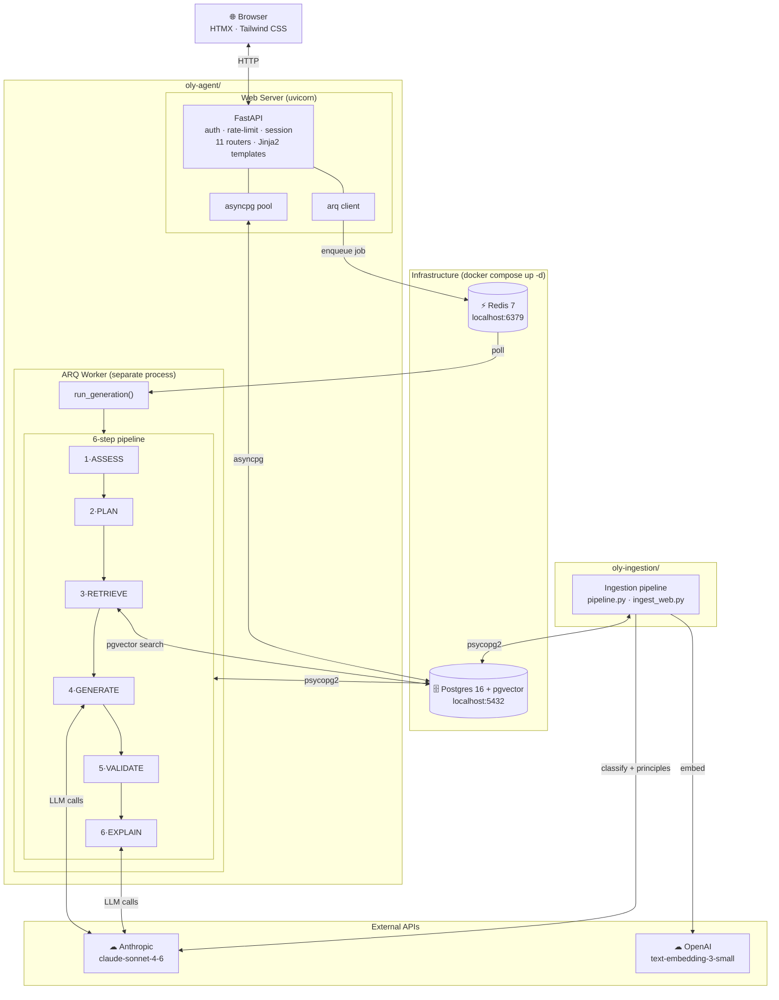
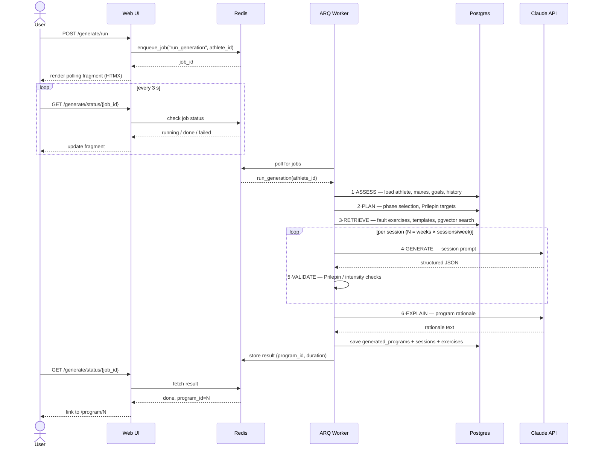
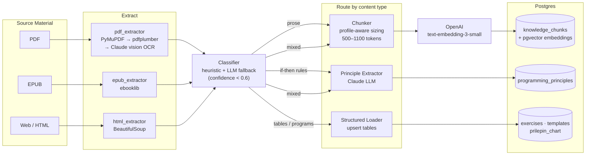
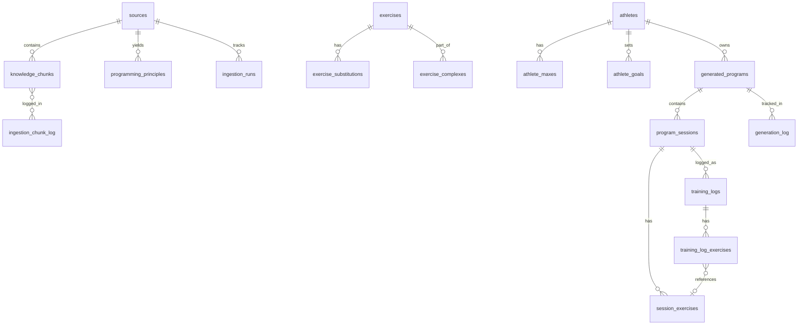

# Architecture

## Services Overview



---

## Program Generation Flow



---

## Ingestion Pipeline Flow



---

## Database Schema (20 tables)



---

## Local Development

Three processes must be running simultaneously:

| Process | Command | Purpose |
|---------|---------|---------|
| Infrastructure | `cd oly-ingestion && docker compose up -d` | Postgres + Redis |
| Web server | `cd oly-agent && PYTHONUTF8=1 uv run uvicorn web.app:app --reload --port 8080` | Serves the UI |
| ARQ worker | `cd oly-agent && PYTHONUTF8=1 uv run arq web.worker.WorkerSettings` | Runs generation jobs |

The web server and ARQ worker are **separate OS processes** — both connect to the same Redis and Postgres. The worker can be restarted independently without affecting the web server.

---

## Production Deployment

```
                     ┌─────────────────────────────────────────┐
Internet ──► Reverse │  nginx / Caddy / ALB  (HTTPS termination)│
             Proxy   └──────────────┬──────────────────────────┘
                                    │ HTTP
                     ┌──────────────▼──────────────┐
                     │  uvicorn  (web.app:app)       │  ← 1+ instances
                     └──────────────┬──────────────┘
                                    │ asyncpg / arq
              ┌─────────────────────┼─────────────────────┐
              │                     │                     │
   ┌──────────▼──────┐   ┌──────────▼──────┐   ┌─────────▼───────┐
   │   Postgres 16   │   │    Redis 7       │   │   ARQ Worker    │
   │   + pgvector    │   │                 │   │  (1 process,    │
   └─────────────────┘   └─────────────────┘   │   max_jobs=1)   │
                                                └─────────────────┘
```

**Required environment variables for production:**

| Variable | Purpose |
|----------|---------|
| `DATABASE_URL` | Full Postgres connection string (required — no localhost fallback) |
| `SECRET_KEY` | Session signing key — must be stable across restarts |
| `REDIS_URL` | Redis connection string (default: `redis://localhost:6379`) |
| `HTTPS_ONLY` | Set to `true` to enable `Secure` cookie flag |
| `ANTHROPIC_API_KEY` | Claude API — required for generation |
| `OPENAI_API_KEY` | OpenAI embeddings — required for vector search |

See [`SECURITY.md`](SECURITY.md) for the full security audit and deployment checklist.
