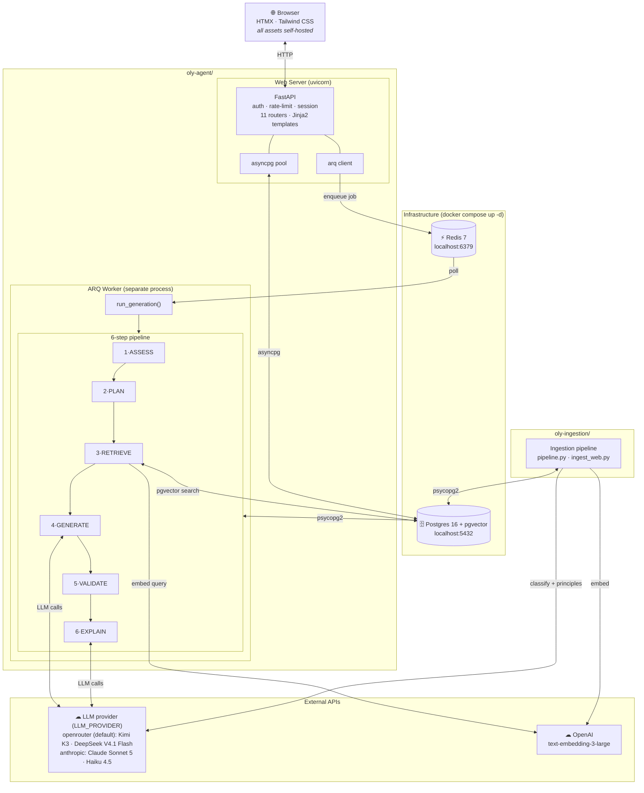
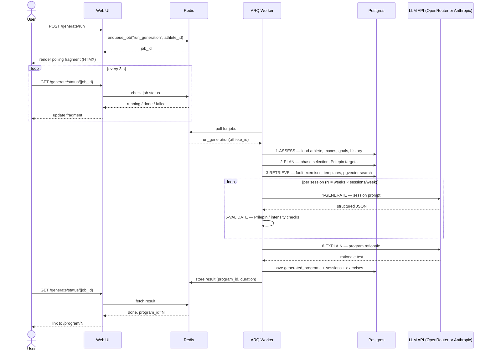
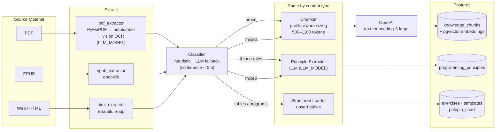
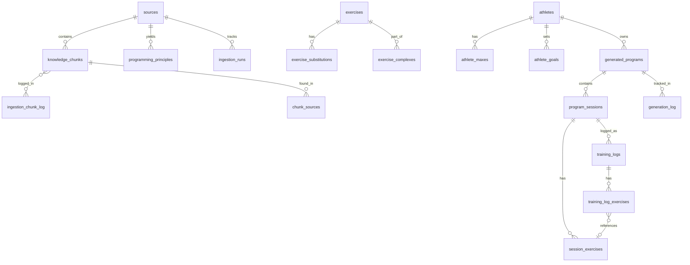

# Architecture

## Services Overview


```mermaid
flowchart TB
    Browser["🌐 Browser<br/>HTMX · Tailwind CSS<br/><i>all assets self-hosted</i>"]

    subgraph infra["Infrastructure  (docker compose up -d)"]
        PG[("🗄 Postgres 16 + pgvector<br/>localhost:5432")]
        RD[("⚡ Redis 7<br/>localhost:6379")]
    end

    subgraph agent["oly-agent/"]
        subgraph web["Web Server  (uvicorn)"]
            App["FastAPI<br/>auth · rate-limit · session<br/>11 routers · Jinja2 templates"]
            APool["asyncpg pool"]
            AQueue["arq client"]
        end

        subgraph worker["ARQ Worker  (separate process)"]
            WFn["run_generation()"]
            subgraph pipe["6-step pipeline"]
                direction LR
                S1["1·ASSESS"] --> S2["2·PLAN"] --> S3["3·RETRIEVE"]
                S3 --> S4["4·GENERATE"] --> S5["5·VALIDATE"] --> S6["6·EXPLAIN"]
            end
        end
    end

    subgraph ingestion["oly-ingestion/"]
        Ing["Ingestion pipeline<br/>pipeline.py · ingest_web.py"]
    end

    subgraph ext["External APIs"]
        Anthropic["☁ LLM provider (LLM_PROVIDER)<br/>openrouter (default): Kimi K3 · DeepSeek V4.1 Flash<br/>anthropic: Claude Sonnet 5 · Haiku 4.5"]
        OpenAI["☁ OpenAI<br/>text-embedding-3-large"]
    end

    Browser <-->|HTTP| App
    App --- APool & AQueue
    APool <-->|asyncpg| PG
    AQueue -->|enqueue job| RD
    RD -->|poll| WFn
    WFn --> pipe
    pipe <-->|psycopg2| PG
    S4 & S6 <-->|LLM calls| Anthropic
    S3 <-->|pgvector search| PG
    S3 -->|embed query| OpenAI

    Ing <-->|psycopg2| PG
    Ing -->|embed| OpenAI
    Ing -->|classify + principles| Anthropic
```

> _Static PNG: [docs/arch-services.png](docs/arch-services.png)_

---

## Program Generation Flow


```mermaid
sequenceDiagram
    actor User
    participant UI as Web UI
    participant Redis
    participant Worker as ARQ Worker
    participant DB as Postgres
    participant LLM as LLM API (OpenRouter or Anthropic)

    User->>UI: POST /generate/run
    UI->>Redis: enqueue_job("run_generation", athlete_id)
    Redis-->>UI: job_id
    UI-->>User: render polling fragment (HTMX)

    loop every 3 s
        User->>UI: GET /generate/status/{job_id}
        UI->>Redis: check job status
        Redis-->>UI: running / done / failed
        UI-->>User: update fragment
    end

    Worker->>Redis: poll for jobs
    Redis-->>Worker: run_generation(athlete_id)

    Worker->>DB: 1·ASSESS — load athlete, maxes, goals, history
    Worker->>DB: 2·PLAN — phase selection, Prilepin targets
    Worker->>DB: 3·RETRIEVE — fault exercises, templates, pgvector search
    loop per session (N = weeks × sessions/week)
        Worker->>LLM: 4·GENERATE — session prompt
        LLM-->>Worker: structured JSON
        Worker->>Worker: 5·VALIDATE — Prilepin / intensity checks
    end
    Worker->>LLM: 6·EXPLAIN — program rationale
    LLM-->>Worker: rationale text
    Worker->>DB: save generated_programs + sessions + exercises
    Worker->>Redis: store result (program_id, duration)

    User->>UI: GET /generate/status/{job_id}
    UI->>Redis: fetch result
    Redis-->>UI: done, program_id=N
    UI-->>User: link to /program/N
```

> _Static PNG: [docs/arch-sequence.png](docs/arch-sequence.png)_

---

## Ingestion Pipeline Flow


```mermaid
flowchart LR
    subgraph src["Source Material"]
        PDF[PDF]
        EPUB[EPUB]
        WEB[Web / HTML]
    end

    subgraph extract["Extract"]
        PE["pdf_extractor<br/>PyMuPDF → pdfplumber<br/>→ vision OCR (LLM_MODEL)"]
        EE["epub_extractor<br/>ebooklib"]
        HE["html_extractor<br/>BeautifulSoup"]
    end

    CLASS["Classifier<br/>heuristic + LLM fallback<br/>(confidence < 0.6)"]

    subgraph route["Route by content type"]
        CHUNK["Chunker<br/>profile-aware sizing<br/>500–1100 tokens"]
        SL["Structured Loader<br/>upsert tables"]
        PEX["Principle Extractor<br/>LLM (LLM_MODEL)"]
    end

    subgraph store["Postgres"]
        KC[("knowledge_chunks<br/>+ pgvector embeddings")]
        PP[("programming_principles")]
        EX[("exercises · templates<br/>prilepin_chart")]
    end

    OAI["OpenAI<br/>text-embedding-3-large"]

    PDF --> PE --> CLASS
    EPUB --> EE --> CLASS
    WEB --> HE --> CLASS

    CLASS -->|prose| CHUNK --> OAI --> KC
    CLASS -->|tables / programs| SL --> EX
    CLASS -->|if-then rules| PEX --> PP
    CLASS -->|mixed| CHUNK & PEX
```

> _Static PNG: [docs/arch-ingestion.png](docs/arch-ingestion.png)_

---

## Database Schema (21 tables)

Core relationships only; the full table reference is [docs/SCHEMA.md](docs/SCHEMA.md), and the Alembic migrations in `oly-agent/migrations/versions/` are the source of truth.


```mermaid
erDiagram
    sources ||--o{ knowledge_chunks : contains
    sources ||--o{ programming_principles : yields
    sources ||--o{ ingestion_runs : tracks

    knowledge_chunks }o--o{ ingestion_chunk_log : logged_in
    knowledge_chunks ||--o{ chunk_sources : found_in
    exercises ||--o{ exercise_substitutions : has
    exercises ||--o{ exercise_complexes : part_of

    athletes ||--o{ athlete_maxes : has
    athletes ||--o{ athlete_goals : sets
    athletes ||--o{ generated_programs : owns

    generated_programs ||--o{ program_sessions : contains
    generated_programs ||--o{ generation_log : tracked_in

    program_sessions ||--o{ session_exercises : has
    program_sessions ||--o{ training_logs : logged_as

    training_logs ||--o{ training_log_exercises : has
    training_log_exercises }o--o| session_exercises : references
```

> _Static PNG: [docs/arch-er.png](docs/arch-er.png)_

---

## Local Development

Three processes must be running simultaneously:

| Process | Command | Purpose |
|---------|---------|---------|
| Infrastructure | `make up` | Postgres + PgBouncer + Redis (`oly-ingestion/docker-compose.yml`) |
| Web server | `make web` | Serves the UI on :8080 |
| ARQ worker | `make worker` | Runs generation jobs |

The web server and ARQ worker are **separate OS processes** — both connect to the same Redis and Postgres. The worker can be restarted independently without affecting the web server.

---

## Production Deployment

```
                     ┌─────────────────────────────────────────┐
Internet ──► Reverse │  nginx / Caddy / ALB  (HTTPS termination)│
             Proxy   └──────────────┬──────────────────────────┘
                                    │ HTTP
                     ┌──────────────▼──────────────┐
                     │  uvicorn  (web.app:app)       │  ← 1+ instances
                     └──────────────┬──────────────┘
                                    │ asyncpg / arq
              ┌─────────────────────┼─────────────────────┐
              │                     │                     │
   ┌──────────▼──────┐   ┌──────────▼──────┐   ┌─────────▼───────┐
   │   Postgres 16   │   │    Redis 7       │   │   ARQ Worker    │
   │   + pgvector    │   │                 │   │  (1 process,    │
   └─────────────────┘   └─────────────────┘   │   max_jobs=1)   │
                                                └─────────────────┘
```

**Static assets.** The browser makes no third-party requests: Tailwind (compiled),
htmx, Chart.js and both webfonts are all served from `/static`. The app will serve
them itself, but they are immutable and better handed to the reverse proxy with a
long `Cache-Control` — see S3 in [docs/CONTRIBUTING.md](docs/CONTRIBUTING.md). No
outbound internet access is needed to render a page, and a Content-Security-Policy
can be `default-src 'self'` apart from the inline `<script>` blocks in
`base.html`/`program.html`.

**Required environment variables for production:**

| Variable | Purpose |
|----------|---------|
| `DATABASE_URL` | Full Postgres connection string. **Falls back to `localhost` with a logged warning when unset** — set it explicitly in production so a missing var can't silently point at the wrong host. |
| `SECRET_KEY` | Session signing key — must be stable across restarts |
| `REDIS_URL` | Redis connection string (default: `redis://localhost:6379`) |
| `HTTPS_ONLY` | Set to `true` to enable `Secure` cookie flag |
| `LLM_PROVIDER` | `openrouter` (the code default) or `anthropic`. Picks the endpoint and the model defaults: under `openrouter`, generation / explanation / ingestion run on `moonshotai/kimi-k3`, light tasks on `deepseek/deepseek-v4.1-flash`, the eval judge on `z-ai/glm-5.3-flash`; under `anthropic`, Claude Sonnet 5 / Haiku 4.5. Each role is overridable (`GENERATION_MODEL`, `EXPLANATION_MODEL`, `LLM_MODEL`, `LIGHT_MODEL`, `JUDGE_MODEL`) — see `oly-ingestion/.env.example` |
| `OPENROUTER_API_KEY` | Required for generation with `LLM_PROVIDER=openrouter` (the default) |
| `ANTHROPIC_API_KEY` | Required only with `LLM_PROVIDER=anthropic` — the only provider with Message Batches (`--batch` ingestion) |
| `LLM_BASE_URL` | Optional endpoint override; blank = the provider's default |
| `OPENAI_API_KEY` | OpenAI embeddings (`text-embedding-3-large` at 1536 dims) — required for vector search, including query embedding in the worker |

See [`docs/design/SECURITY.md`](docs/design/SECURITY.md) for the full security audit and deployment checklist.
