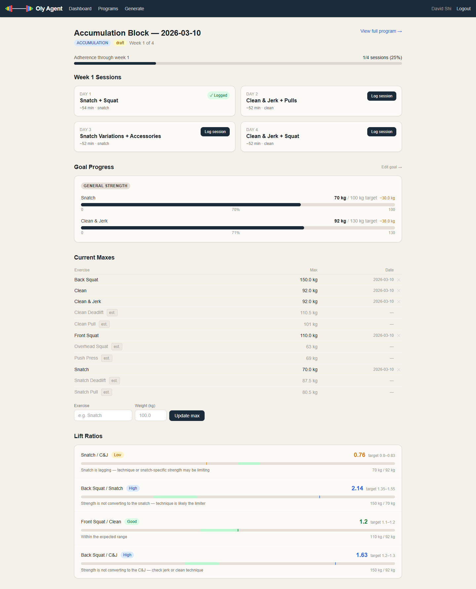
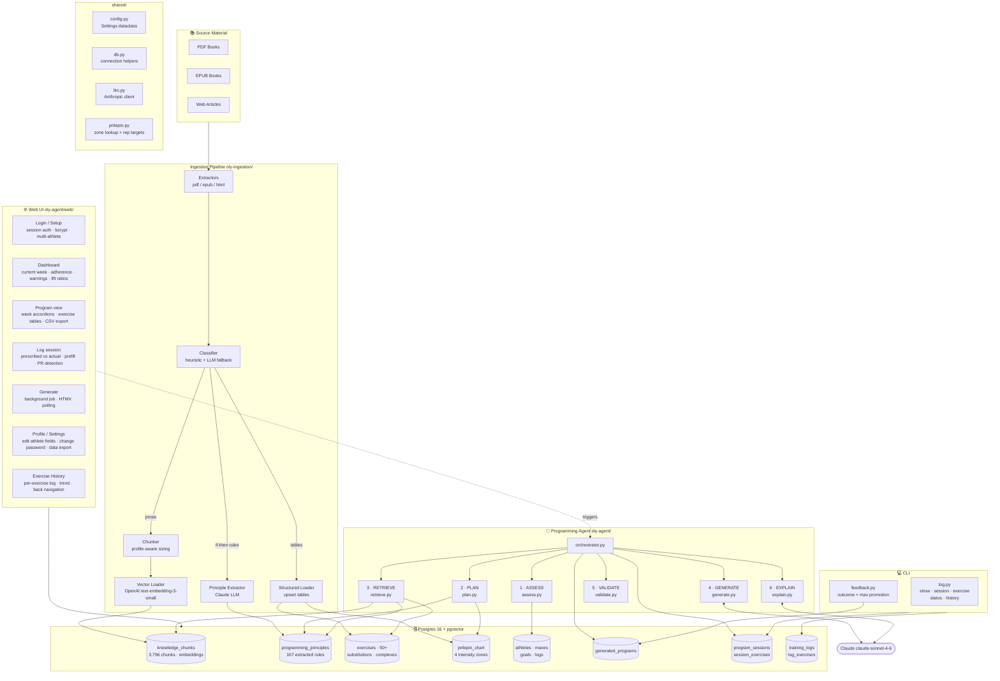
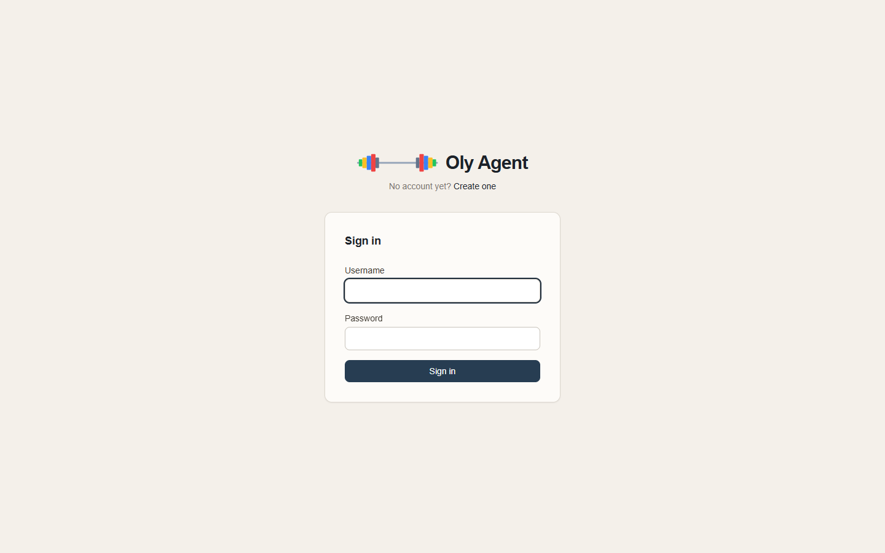
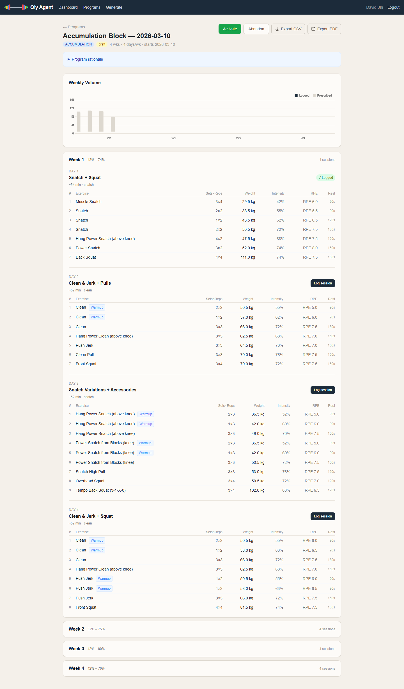
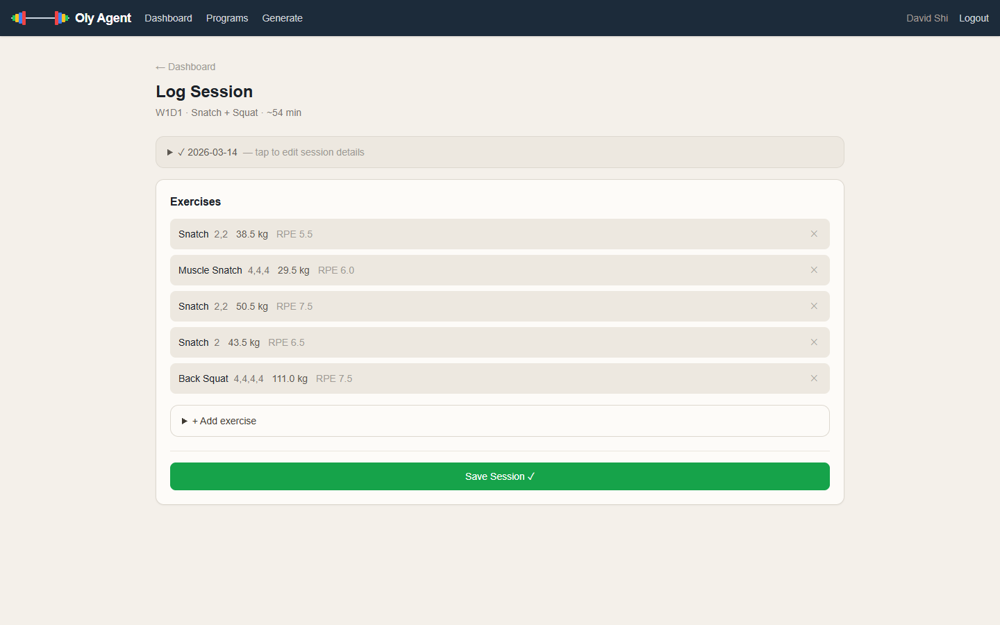
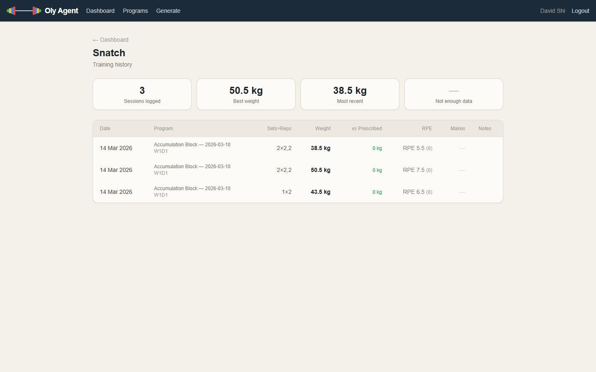
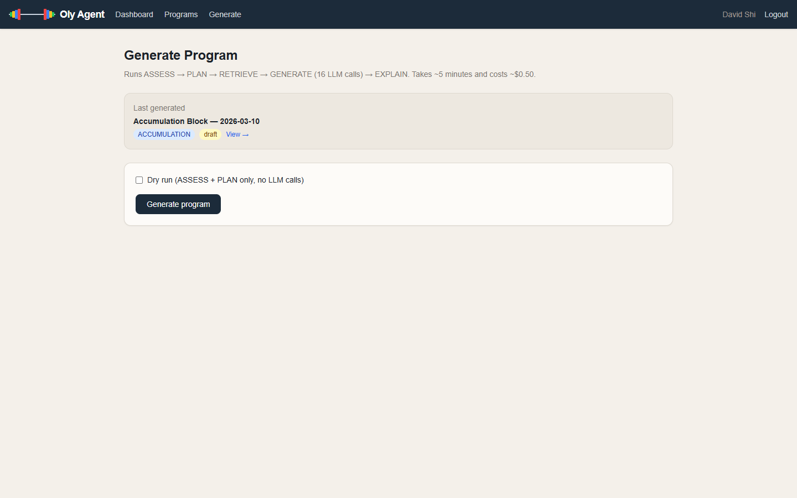
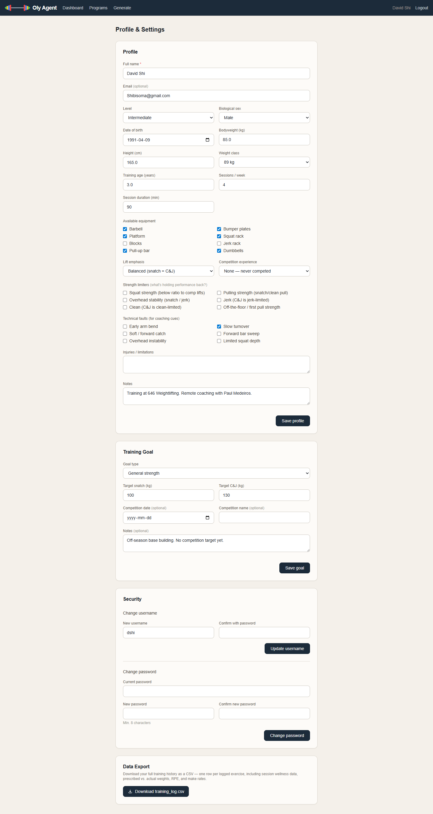

# Olympic Weightlifting Program Generator

Generates personalised Olympic weightlifting mesocycles from a RAG pipeline built on 3,796 chunks of coaching literature across 11 sources. A 6-step agent pipeline — ASSESS → PLAN → RETRIEVE → GENERATE → VALIDATE → EXPLAIN — applies Prilepin's chart programmatically to enforce per-session volume and intensity constraints before writing each session to the database. Ships with a full FastAPI + HTMX web UI, ARQ background job queue, session logging with PR detection, and 275 unit tests.

**Stack:** Python 3.11 · FastAPI · HTMX · asyncpg · Postgres 16 + pgvector · Redis · ARQ · Claude (`claude-sonnet-4-6`) · OpenAI embeddings · Alembic · uv · Docker



---

## Demo

> **Add a short walkthrough here** — a GIF or screen recording (~60–90 s) covering: account setup → dashboard → program generation → session logging → exercise history.
>
> Tools: [LICEcap](https://www.cockos.com/licecap/) (Windows/macOS) or [Peek](https://github.com/phw/peek) (Linux) for GIF capture. Export at ~800 px wide and commit as `screenshots/demo.gif`.

---

## Architecture



> _If the diagram above doesn't render, see the static PNG: [docs/arch-main.png](docs/arch-main.png)_

---

## Agent Pipeline

Each program generation runs 6 steps in sequence:

| Step | Module | What it does |
|------|--------|-------------|
| 1 · ASSESS | `assess.py` | Load athlete profile, maxes, active goal, recent training history, technical faults |
| 2 · PLAN | `plan.py` | Select phase (accumulation / intensification / realization / general prep) and duration; build per-week intensity and volume targets using Prilepin's chart |
| 3 · RETRIEVE | `retrieve.py` | Fetch fault-targeted exercises via structured lookup; retrieve relevant knowledge chunks via pgvector cosine similarity (min 0.45) |
| 4 · GENERATE | `generate.py` | One LLM call per session with full context; retries on JSON parse or validation failures |
| 5 · VALIDATE | `validate.py` | Enforce Prilepin rep ranges, intensity envelope, reps-per-set limits, avoid-list, and principle adherence |
| 6 · EXPLAIN | `explain.py` | One LLM call producing a structured rationale with per-section headings |

A 4-week, 4-session/week program = 16 sessions × ~1–2 LLM calls + 1 explain call ≈ **$0.40–0.50** at current Claude pricing.

---

## Programming Model

- **Prilepin's chart** enforced programmatically per session and intensity zone. Hard cap at 1.5× the range ceiling to account for multiple snatch variations referencing the same max.
- **Phase progression** is automatic: adherence ≥ 70% and make rate ≥ 75% in the previous block advances to the next phase; high RPE deviation blocks advancement. Phase and outcome data feed directly into the next program's intensity and volume targets.
- **Cold-start safety**: first program → intensity capped at 80%, max 4 weeks, max exercise complexity 3.
- **Warmup sets**: 2–3 sets at 50–60% prescribed before every competition lift or heavy pull.
- **Pydantic validation** on the `outcome_summary` JSONB field at both write (`feedback.py`) and read (`plan.py`, `generate.py`) boundaries — bad data raises immediately rather than silently degrading future programs.

---

## Knowledge Corpus

Content routed before chunking — classifier sends each section to exactly one path (prose → vector store, if-then rules → principle extraction, tables → structured tables, mixed → both).

| Source | Format | Chunks | Principles |
|--------|--------|--------|------------|
| Everett — *Olympic Weightlifting* | EPUB | 587 | 76 |
| Zatsiorsky — *Science and Practice of Strength Training* | PDF | 430 | 7 |
| Drechsler — *Weightlifting Encyclopedia* | PDF | 603 | 6 |
| Catalyst Athletics articles | Web (HTML) | 446 | 22 |
| Laputin — *Managing the Training of Weightlifters* | PDF (vision OCR) | 110 | 3 |
| Medvedev — *A Program of Multi-Year Training in Weightlifting* | PDF (vision OCR) | 617 | 0 |
| Everett — *Olympic Weightlifting for Sports* | PDF | 172 | 0 |
| Israetel — *Scientific Principles of Hypertrophy Training* | EPUB | 206 | 21 |
| Starrett — *Becoming a Supple Leopard* | EPUB | 137 | 16 |
| Dan John — *Intervention* | PDF | 266 | 0 |
| Takano — *Weightlifting Programming: A Winning Coach's Guide* | PDF | 218 | 0 |
| **Total** | | **3,796** | **151** |

> Retrieval quality baseline scores (22 eval queries, top_k=5, min_sim=0.45): [docs/RETRIEVAL_EVAL.md](docs/RETRIEVAL_EVAL.md)

---

## Web UI

FastAPI + Jinja2 + HTMX — no npm, no build step.

| Page | URL | Description |
|------|-----|-------------|
| Login / Signup | `/login` `/setup` | bcrypt auth, session cookies, multi-athlete support |
| Dashboard | `/` | Current week, adherence, active warnings, lift ratio analysis |
| Program detail | `/program/{id}` | Week accordions, exercise tables, rationale; activate / complete / abandon; CSV export |
| Log session | `/log/{session_id}` | Prescribed exercises prefilled; inline add/edit/delete; PR banner |
| Exercise history | `/history` | Per-exercise trend across all logged sessions |
| Generate | `/generate` | Background job via ARQ + Redis; HTMX polls every 3 s |
| Profile | `/profile` | Edit athlete fields, change password/username, download training log CSV |
| Admin | `/admin/jobs` | Generation job history — cost, session counts, errors per program (admin only) |

---

## Screenshots

<details>
<summary>Show all screenshots</summary>

**Login**


**Program detail** — week accordions, exercise tables with weights / intensity / RPE


**Session logging** — prescribed exercises prefilled, log actual sets/reps/weight/RPE


**Exercise history** — per-exercise trend across all logged sessions


**Generate** — triggers the 6-step agent pipeline as a background job


**Profile**


</details>

---

## Quick Start

```bash
make sync && make up && make migrate  # install deps, start Docker, apply migrations
make web                               # uvicorn on :8080
make worker                            # ARQ worker (separate terminal)
```

Full setup guide, ingestion instructions, CLI usage, and backup/restore: **[docs/SETUP.md](docs/SETUP.md)**

```bash
make test     # 275 unit tests — no DB or API keys needed
make coverage # coverage report
```

> Full service and deployment architecture: [ARCHITECTURE.md](ARCHITECTURE.md)
